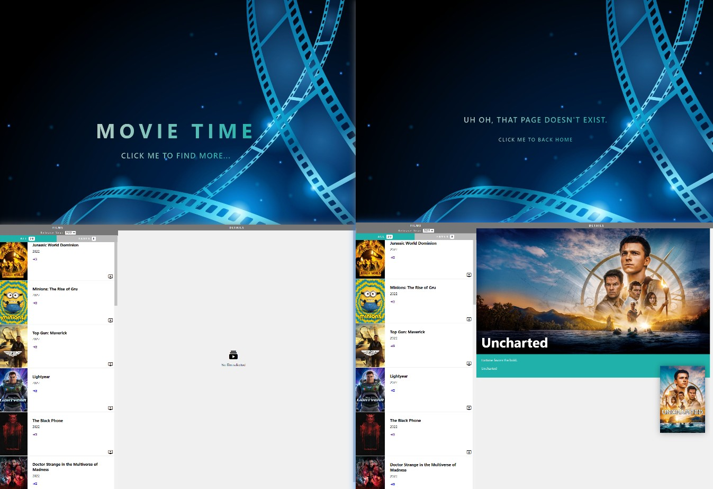

# Friday Night Films Part 2

## Available Scripts
In the project directory,

you should install all the independencies,
```
npm install
```

then you can run:
```
npm start
```

Runs the app in the development mode.

Open http://localhost:3000 to view it in your browser.

The page will reload when you make changes.
You may also see any lint errors in the console.
## Task preview


## Film Project - Part 3
This follows on from Part 1 and Part 2 you need to have finished Part 1, but you do not need to have finished Part 2.

### Using React Router
You'll need to install react router:

yarn add react-router-dom@6
You'll need to add BrowserRouter and a set of Routes at the very top of your App:
```
function App() {
  return (
    <BrowserRouter>
      <Routes>
        <Route path="/films" element={<FilmLibrary/>} />
      </Routes>
    </BrowserRouter>
  );
}
```
Now you'll only be able to see your films app if you go to http://localhost:3000/films

### Step 1: Add a home page
Add a separate home page for when you go to http://localhost:3000/ (without /films).

You can put whatever you want on this page! But make sure it includes a Link component to get to /films to see the main app.

Hint: You'll need a new React component for the new page.

### Step 2: Add a not-found page
Add another component which will be a not-found page. If you enter any invalid URL (anything that's not / and not /films) it should show this page.

Include a nice message like "Uh oh, that page doesn't exist."

### Step 3: URL and links for each film detail page
Go to your FilmRow component.

Replace the "more details" button with a React Router Link component. (Yours might be a bit different. That's ok!)

```
<Link to={`/films/${props.film.id}`} className="action">
  <span className="material-icons">read_more</span>
</Link>
```
Your new Link component will change the URL to a URL with the film ID in it.

Find a way to change your code so that this Link works like the button did before. Clicking it should show the details of the film in the FilmDetail component.

You should be able to load these pages (directly in the URL bar):

http://localhost:3000/films should still work, but should say 'No film selected' instead of showing film details.
http://localhost:3000/films/335787 should load details for the movie 'Uncharted'
http://localhost:3000/films/508947 should load details for the movie 'Turning Red'
Hint: You will likely need to change how the FilmDetails component gets data from the API. It cannot use the button click event anymore, and you may need useEffect.